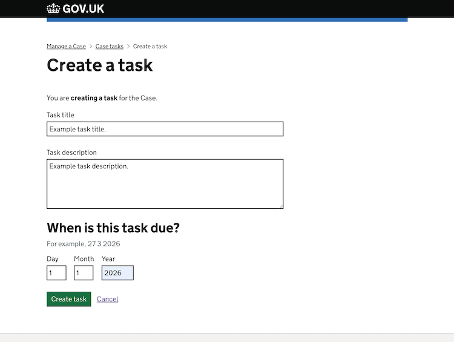

# HMCTS Dev Test Frontend

My attempt at developing a frontend for a HMCTS case management system.

You should be able to run this by running:

1. `yarn install`
2. `yarn webpack`
3. `yarn start:dev` or navigate to package.json and run the script manually

## Summary

This frontend application assumes the context of the example Case, presenting the Case's tasks to the user and providing the user with the tools to manage them.
I have used the GOV UK tech stack, folliwing the GOV UK Design System patterns and using its components as best as I could when designing the Nunjucks views.
There is error handling and CSRF considerations.

For testing, I have written unit and route tests. These can be run using `yarn test:unit` and `yarn test:routes` respectively.

The Spring Boot backend is here: https://github.com/owensteel/hmcts-dev-test-backend-submission/

## User flow / Implementations

### Homepage (case details)

The homepage displays details of the Case we are focused on. The interface uses the "tabs" component to show the user that the case tasks index page and the case details page are connected, though both are separate routes.

### Case tasks index

An index displaying a list of the case's tasks. These are sorted by due date initially, but the user can choose how to sort or filter them, e.g filter by status or sort alphabetically by title.
The tasks list is divided into pages for ease of reading and processing by the user. I ensured that the list is not too far up the interface so that the user would not have to constantly scroll down again every time they go to the next page.
Each task has links to view (where the edit links are) or delete it. The delete link is included so that the user would not have to click through an irrelevant page to get to it.
The button that will lead to the "create a task" form is in the "start format", to indicate to the user that it will lead to a form and not perform an action in itself.

### Create a task

A form that allows the user to create a task.

Inputs are validated and errors are shown to the user if any. In this case, leaving the title blank and the date in the past is a violation, but since a description is optional (as outlined in the challenge requirements) it is fine to leave it blank.

### View a task

Each task has its own page for the user to view it in. This is because it has details (like the description) that cannot be shown in the index table in a user-friendly way. From here the user can also edit specific attributes.

### Edit/update a task

Following guidelines for accessibility, each attribute of a task has its own specific edit page. In this case, the user is updating the task's status. The user is given context about what they are doing and task they are editing.

The edit forms have validation as well.

The process for deleting/clearing a task's description is special in that it doesn't need input from the user at all, just confirmation via a button.

### Deleting a task

As this is a potentially dangerous action, the confirmation button here is red, to make sure the user thinks twice. The user is also given plenty of context about what they are doing on the page.

